# Portafolio de Historia del Arte de la Edad Moderna en España

En las tres etapas trabajaré con un solo edificio o monumento, que ya de por sí es obra arquitectónica, que incluya a su vez esculturas y pinturas. Este edificio es interesante primero por lo improbable de su localización, "porque pudo y porque quiso", en medio de La Mancha, y segundo por la importación de artistas italianos que crearon una obra con poca relación con el entorno y una influencia arquitectónica y artística considerable.

Dado que se trata para cada una de las épocas de una obra examinada en los tres aspectos: pictórico, arquitectónico y plástico, haremos un solo apartado de contexto para cada uno de ellos.

## Palacio del Marqués de Santa Cruz en el Viso del Marqués

Álvaro de Bazán venía de un linaje procedente del valle del Baztán, linaje guerrero que había participado en la toma de Granada y en otros hechos de armas, siempre al servicio del rey de España. El padre del mismo compró la encomienda de la orden de Calatrava que tenia su sede en el Viso, y comenzó la relación del linaje con Génova, especialmente con la familia Doria, una de las familias que formaban parte del consejo rector de la república, alianza que se cimentó en hechos de armas y también en una relación personal, con Álvaro de Bazán viviendo en uno del palacios de los Doria (probablemente el Doria-Tulsi) durante algún tiempo.
En el lugar donde está ahora el palacio había una serie de casas de la orden, pasadas a su propiedad cuando adquirió la encomienda. Cuando pudo por tener suficiente liquidez económica, más que cuando quiso, Álvaro de Bazán decidió usar el lugar de esas casas para un palacio que le sirviera de casa de linaje; probablemente unos años más tarde decidió hacer también un monumento a su fama y a su fortuna.

Este edificio y programa iconográfico, salvo algunos cambios y restauraciones más o menos afortunadas, se pueden contemplar todavía hoy, cuando sigue en uso como archivo histórico de la Armada.

### Arquitectura del palacio del Marqués de Santa Cruz
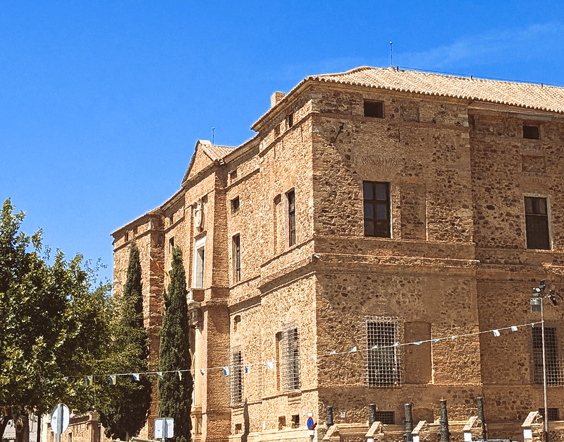{height=3in}

En este apartado nos referiremos al edificio en sí.

#### Autor

Encargo de Álvaro de Bazán, se cree que puede tener trazas de Enrique Egas "El Mozo" o incluso de Covarrubias ([@martinez2023materiales] citando a [@alma991007469429704990, p. 381]), aunque este dice "quizá". Se sabe que la escalera la proyectó Giovanni Battista Castello llamado El Bergamasco, que actuó como maestro de obras junto con un tal Olamasquín o posiblemente Cremaschino, es decir, Gian Battista Perolli que posteriormente se llamaría Juan Bautista Peroli. A este se atribuye en muchas obras como El Siglo del Renacimiento [@alma991003192069704990, p84] su autoría de forma exclusiva.

#### Cronología

Se sabe que en 1562 estaba ya comenzada [@martinez2023materiales], para terminar más allá de 1588. Por lo tanto, se trata de un Renacimiento pleno en la cronología española, manierismo en la italiana.

#### Tipología

Aunque está claro que se trata de un palacio, tiene elementos tanto de casa de linaje como de villa campestre (un jardín) o "casa de campo fortificada" [@teos1999casa]. Podría definirse, por su similitud con el Alcázar de Madrid y el de Toledo, como un alcázar-palacio.

#### Análisis descriptivo

Está documentado que Enrique Egás el Mozo estuvo como máximo dos años, apenas el tiempo suficiente para la traza general y el exterior del edifio, después de haber trabajado en edificios que corresponderían a la tipología alcázar-palacio.

Se trata de un edificio ligeramente rectangular con patio interior y jardín situado a la izquierda del eje principal. Puede que esta intención inicial explique el exterior austero y sin apenas decoración aparte de la portada, con un ligero resalte con respecto a la fachada principal que a su vez está inclinado, con más grosor en la base que en altura.

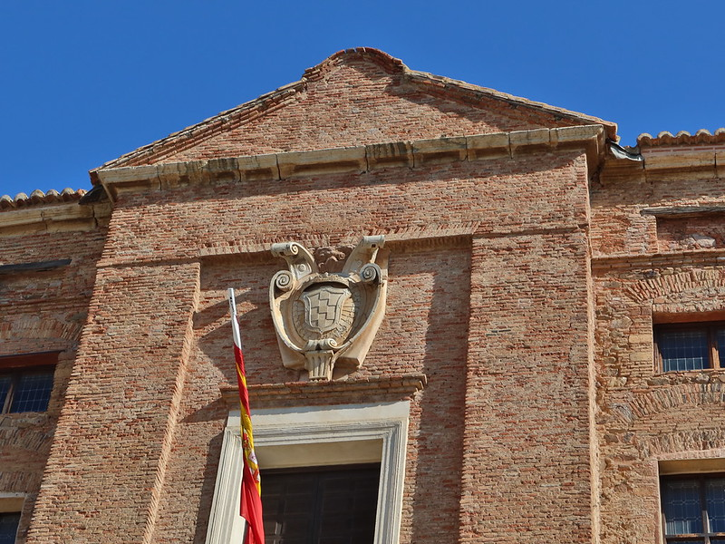{height=3in}

El aspecto que presenta hoy en día la misma (en la imagen, el piso superior) no es el original, siendo remodelado por Pedro Arnal en el siglo XVIII [@martinez2023materiales]; aunque incluye elementos de la fábrica inicial, incorpora también dos contrafuertes para evitar el derrumbe de la misma. La portada original tenía cuatro torres esquineras a modo de alcázar, como se ha dicho, que fueron derribadas tras las grietas que aparecieron en las mismas durante el terremoto de Lisboa. La construcción es en ladrillo, sin más decoración en las ventanas que unos arcos construidos también con ladrillos verticales del mismo tipo.

En 1564, sin embargo, por razones desconocidas, se encarga la dirección de las obras al dicho Bergamasco. Este era un arquitecto y pintor genovés que había trabajado en diferentes palacios de los denominados *del Rolli*, es decir, obligados por la Signoria a alojar a visitantes ilustres en caso de que se les requiriera, incluyendo una para una gran familia, los Grimani. Aunque algunas fuentes indican que el contacto con el marqués llegaría a través del Zenete, lo cierto es que se dio el caso del conocimiento de los palacios Doria por parte de Álvaro de Bazán y la disponibilidad de uno de los arquitectos que había trabajado en palacios del mismo estilo, Giovanni (o Giovan) Battista Castello. Su llegada provocó un cambio radical en el palacio, y con ello introdujo una nueva tipología inexistente hasta ese momento en la península.

Donde comenzamos a apreciar todo el esplendor renacentista es al entrar el edificio y encontrarnos en el patio.

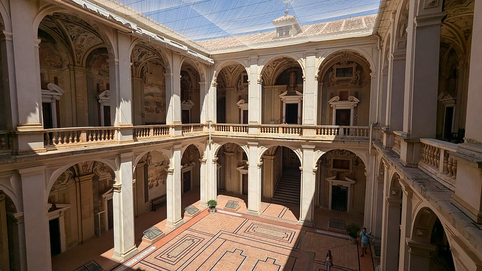{height=3in}

Este patio rectangular de dos pisos, con tres arcos de medio punto en el lado más estrecho y cuatro en el más ancho, siguiendo una proporción 3/4 clásica, como se ha indicado, por ejemplo, en los escritos de Vignola, que se encontraron entre las propiedades de Castello a su muerte [@garcia2011aproximacion]; aparte de este conocimiento de las reglas de Vignola, Castello estaba familiarizado con su plasmación en los palacios de Génova. Esta influencia se verá de una forma más o menos directa en este patio.

Esa influencia vignolesca se ve también en la arquitectura desornamentada y planar de las arcadas de este patio. Se prefieren pilastras frente a columnas, de orden dórico en el piso bajo, de orden jónico en el piso alto; los intradoses de los arcos están decorados con diamantes y cajeados simulados, un recurso también clásico sacado de los tratados de arquitectura al uso. Este motivo se repite también en los intradoses de los arcos de la escalera y las bóvedas de las dos plantas, aunque con más decoración, y también en el intradós de las arcadas de la loggia del piso superior. El paso de una pirámide a un rombo en la segunda planta establece una jerarquía visual que va de lo relativamente sobrio a lo más decorativo

El patio está organizado de forma axial desde la puerta, llevando a una escalera monumental que sí está documentada como creada por el Bergamasco, que de hecho usándola como portafolio fue contratado por Felipe II para que construyera una similar en el Escorial. La escalera ocupa toda la parte trasera del palacio, teniendo un tramo de subida que se bifurca llegando a dos descansillos con sendas hornacinas ocupadas por esculturas (ver más adelante) y dos tramos de subida adicionales. Todos los tramos están cubiertos por bóvedas de cañón afrescadas, siguiendo un programa iconográfico centrado en la fama, las victorias militares y las virtudes del buen soldado español (ver también más adelante).

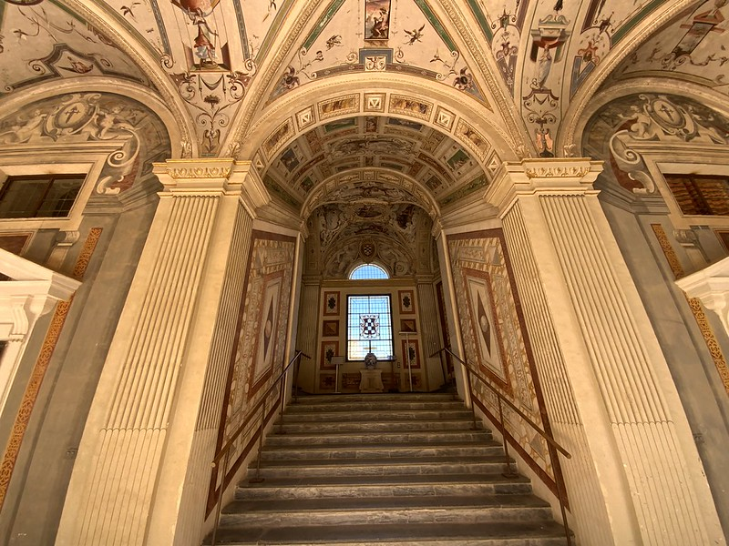{height=3in}

Esta escalera sería la primera de tipo imperial construida en España, y de hecho su novedad y carácter monumental haría que su arquitecto la adoptara también en El Escorial [@lopez2007pintores], aunque con otra configuración abierta en vez de cerrada con bóvedas. En esta escalera, una vez más, se integra la arquitectura simulada con la real alternando arcos decorados con diamantes y florones en el intradós, con trampantojos que simulan mármoles de colores. Esta decoración de los intradoses retoma y potencia los motivos simples de la planta baja, siguiendo una jerarquía visual que parte de lo simple en la planta baja, usando motivos más complicados según se va subiendo; a esto responde el uso de capiteles dóricos en la planta baja y jónicos en la alta, por ejemplo, y el uso de motivos simulados en la planta baja y reales en la segunda planta.

Las estancias superiores dejan la decoración a la pintura, usando capiteles jónicos o corintios simulados que continúan en el artesonado también decorado con frescos y separado de la pared por una moldura estucada. Algunas de las estancias están decoradas con chimeneas también con un frontón partido y decoración sobria.

Finalmente, en el eje axial del patio y justo en el centro  y encima de la escalera imperial se sitúa la capilla, un lugar simbólico que la coloca entre los dos descansillos representando la Virtud y la Fortuna. Este frontón partido tiene una altura ligeramente superior a las dos puertas laterales, marcando una vez más la jerarquía visual. A la derecha de la puerta hay una campana sostenida sobre un simple bastidor. 

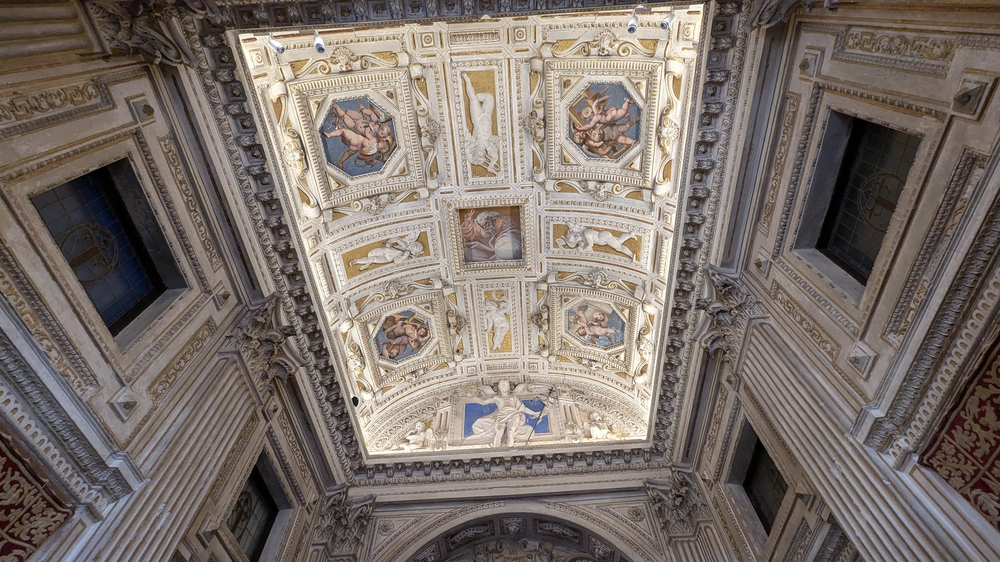

La capilla se diferencia en varios aspectos, siendo el principal el uso de pilastras reales con capitel jónico y bóveda de cañón en vez de artesonado; también usa estucos mezclados con frescos en la decoración de la misma y en el testero encima del altar. La presencia de los ángeles músicos en estuco en la bóveda presagia ya el barroco, aunque se creó en la misma época que el resto de la decoración. Tiene luz natural desde una ventana que da a la galería del patio, y está organizada en una sola nave y dos falsos tramos separados por una pilastra; estas pilastras dejan espacio a ventanas y a paredes con decoración diversa.

Uno de los aspectos en los que el Bergamasco sigue a Vignola, como se ha comentado es en la integración de las arquitecturas simuladas con las reales. Por eso veremos a continuación la pintura en este edificio, para finalizar con la escultura.

### Esculturas de la escalera

El palacio tiene un programa iconográfico que incluye una serie de esculturas simuladas en grisalla de color dorado. Las dos esculturas que se incluyen en el mismo representan al propio Álvaro de Bazán como Neptuno y Marte; en estas serán en las que nos fijemos. Además hay una estatuas sepulcrales en la salida hacia el jardín, que no están accesibles y que no comentaremos, como tampoco comentaremos los estucos que decoran la capilla ni los fanales marinos situados encima de los marcos de las puertas.

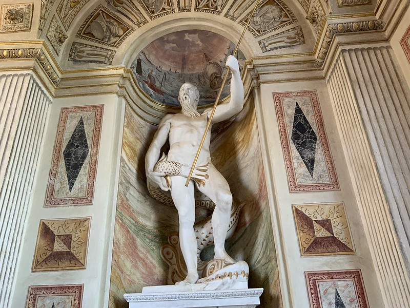{height=3in}

#### Autor

Aunque no hay atribución exacta, se cree que son de Giovanni Battista Perolli, también llamado "Olamasquin" por un error de transcripción o Cremaschino. Se trata del único escultor (y arquitecto) acreditado entre los encargados del palacio, de ahí su atribución [@torrijos2004arte].

#### Cronología

Se hicieron junto con el resto de la decoración del palacio, es decir, los últimos años del siglo XVI, sin saber concretar cuando fue, aunque la documentación indica que se comenzó la decoración desde la planta baja y se avanzó hacia la planta noble.

#### Tipología

Son esculturas de bulto redondo, realizadas en mármol con dorados, posiblemente en pan de oro [@martinez2023materiales]. La tipología compositiva es la de *Mars Victor* o Marte victorioso y de Neptuno Victorioso. Se trata de una escultura manierista, monumental, de tamaño mayor al real y concebida para ser vista en contrapicado. Las estatuas están en un nicho de piedra jaspeada (posiblemente simulada) con bóveda decorada y sobre un pedestal con decoración escultórica.

#### Análisis descriptivo

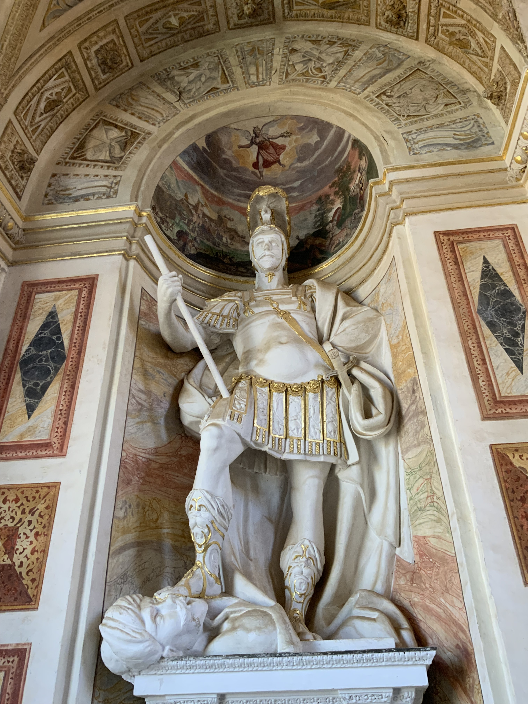{height=3in}

> En [esta dirección](https://www.flickr.com/photos/atalaya/55284202840/in/album-72177720319613040) hay un vídeo que recorre la escalera entre las dos estatuas, mostrando su posición relativa, inclusión en la decoración e iluminación.

Subiendo desde el patio en el descansillo de la derecha se encuentra la estatua de Álvaro de Bazán, en un nicho con una bóveda semiesférica decorada. La estatua se sitúa sobre un pedestal y está enmarcada por dos pilastras acanaladas terminadas en una moldura triple que recorre el interior del nicho. El arco sobre la bóveda semiesférica está decorado con trofeos militares en grisalla. El descansillo donde se encuentran está iluminado por un ventanal, recibiendo las mismas luz natural durante gran parte del día.

La integración de escultura, arquitectura y pintura se acerca al *bel composto* barroco y lo presagia [@teos1999casa].

Sobre el pedestal y en el interior del nicho, con los hombros a la altura de la moldura, se encuentra la estatua de Álvaro de Bazán como Marte y vestido como general romano, con vara de mando y *lorica* y casco emplumado. La pierna derecha, levantada, pisa en una postura denominada *calcatio* la cabeza de una persona con aspecto de turco, turbante y grandes bigotes. La escultura se encuentra en un nicho decorado en su bóveda con escenas de batallas, potenciando ese aspecto de luchador victorioso en una *psicomaquia* o lucha contra el mal.

Los dorados se han usado como resaltes de la armadura, flecos, correa diagonal y para los ataharres de la sandalia, posiblemente como contraste de la cabeza del enemigo vencido. 

En el rellano opuesto se encuentra la imagen de Neptuno también triunfante y realizado con el mismo material; el marco es similar y la decoracion del arco en grisalla también muy similar, salvo que hay algúna caracola, posiblemente en referencia a la cornucopia que representa la fortuna. Esta es también una representación del hombre del renacimiento que es capaz de alcanzar la fama y la fortuna a través de sus decisiones. Neptuno es además el dios marino por excelencia, el que para las tempestades con su *Quos ego*, una imagen también representada en el techo del zaguán. De esta forma el ciclo vital alcanza su plenitud: se comienza en el zaguán con las representaciones de Neptuno, y se concluye con esta estatua "a lo divino" donde Bazán, a través de sus hazañas, ha terminado convirtiéndose en el propio Neptuno [@picciche2025warburg].

Las dos estatuas tienen que entenderse como un todo integral con el programa iconográfico y reflejan también un *cursus honorum* o trayectoria vital del comitente; la posición también es intencionada. Se sube la escalera monumental hacia la derecha y se ve a Álvaro como militar, joven, vital y en un programa iconográfico en la bóveda que enfatiza la *encrucijada* o la elección de la virtud sobre la molicie [@torrijos2007alegoria]. Se sigue ascendiendo por la escalera, se recorre la planta superior que incluye representaciones de ciudades y batallas, así como la estirpe de los Bazán y las virtudes del varón renacentista, y se desciende por la otra escalera, encontrándonos con Neptuno donde Bazán, representado como un anciano sabio, de larga barba, representa la Fortuna a la que se ha llegado a través del esfuerzo y de la virtud cristiana. Una vez más, una concepción integral que es humanista y renacentista en sus temas y casi barroca en su presentación teatral de la vida de una persona.

Esta dualidad de Marte y Neptuno como representantes de la victoria o virtudes militares en tierra y el mar está presente en muchas otras representaciones, sobre todo de estados marineros como Venecia, donde adornan la escalera de los Gigantes en el palacio ducal. No es descartable que Bazán conociera esta iconografía de primera mano.

Donde efectivamente este programa iconográfico se completa es en los frescos del edificio, que veremos a continuación.

### Frescos del edificio

Los frescos cubren las paredes de las habitaciones y patio y las bóvedas y techos de los mismos. Trataremos de concentrarnos sobre todo en los frescos clave, los que entran en diálogo con las esculturas y la arquitectura de forma más estrecha. La principal referencia en este apartado es [@lopez2020lugar].

#### Autor

El autor principal es Battista Perolli, genovés, si bien era costumbre en los palacios genoveses que el arquitecto principal, en este caso el Bergamasco, tuviera la dirección de todo el programa constructivo y decorativo, así que cabe esperar que la contribución del mismo sea considerable. Este Peroli, Perolli, Olamasquin o Cremaschino es también el escultor de Marte y Neptuno, como ya hemos visto.

Por otro lado, Battista Perolli trajo a una serie de ayudantes entre los que se mencionan Cesare de Bellis, Esteban Perolli (al parecer sobrino de Battista) y finalmente Juan Esteban Peroli (con el apellido ya españolizado, es hijo de Battista).

#### Cronología

La etapa decorativa el palacio comenzó a partir de 1574, terminándose en torno a 1589, más o menos cuando el resto del palacio. Algunas partes puede que se concluyeran con anterioridad, como se muestra en los mismos frescos: "Acabóse el año de MDLXXXVI".

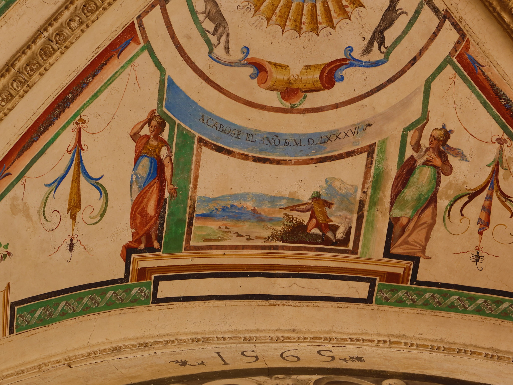{height=3in}

#### Tipología

Se trata de pinturas al fresco usando la técnica tradicional. Incluyen todo tipo de motivos, sobre todo grutescos, grisallas para representar esculturas y un uso generalizado del trampantojo como sustituto o continuación de la arquitectura real.

#### Análisis descriptivo

El programa iconográfico destinado a ensalzar la figura de Álvaro de Bazán, su estirpe y su servicio a la corona es masivo y cubre todas las superficies; se diferencia de los palacios genoveses en que en estos se usaban las paredes para pintar paisajes o exteriores impostados; en este caso, sin embargo, se usan las paredes para representación de batallas y planos o paisajes de ciudades. Estos paisajes aparecen, en tonos desvaídos que simulan la perspectiva aérea, en el Salón de Honor que está rodeado de una "columnata fingida" y en la "Sala de Portugal" (cerrada en esta última visita).
Por eso habría que diferenciar dentro del programa iconográfico dos partes: una parte ilustrativa, una especie de "libro de memoria" y otra parte narrativa, un "viaje del héroe" que seguiría una secuencia temporal comenzando desde el zaguán del edificio y terminando en la puerta del jardín, donde se encuentran las estatuas funerarias de Álvaro y de su última mujer.

Dentro del "libro de memoria" hay ilustraciones relacionadas con diferentes episodios de la vida del marqués, especialmente batallas y lugares relacionados con él, que se tienen que interpretar como documentación de la misma.

- En la planta baja hay sobre los frontones de las puertas diferentes paisajes de ciudades como Bolonia o Argel
- Las paredes entre las puertas tienen murales de batallas como la "Toma de la nao inglesa sobre Marbella" o batallas en el norte de África o Sicilia.
- Encima de las ventanas hay también representaciones de las cruces de las órdenes de Santiago y Calatrava.

Las esquinas del patio están dedicadas a representación de las naciones más importantes en relación con el personaje. A la derecha, el lado del bien y la justicia, las aliadas, España e Italia; a la izquierda, el mal, el imperio otomano y Francia; fuera del flujo narrativo, trata de proyectar la imagen del marqués como un guerrero-humanista [@teos1999casa] y como "conocedor de las naciones" [@mateos1994sala] siguiendl el ideal humanista de Castiglione. Todas estas alegorías siguen el mismo esquema narrativo: una representación de la nación como una diosa en un carro soportada por cuatro pechinas en las que se incluyen alegorías de diferentes ciudades y enmarcados por estas y encima de los frontones de las puertas que hay en las esquinas, estatuas simuladas en grisalla dorada con personajes representativos de estas naciones representados de forma real o alegórica. Por ejemplo, en la esquina española se incluye una representación de Carlos V y Felipe II como emperadores o generales romanos.

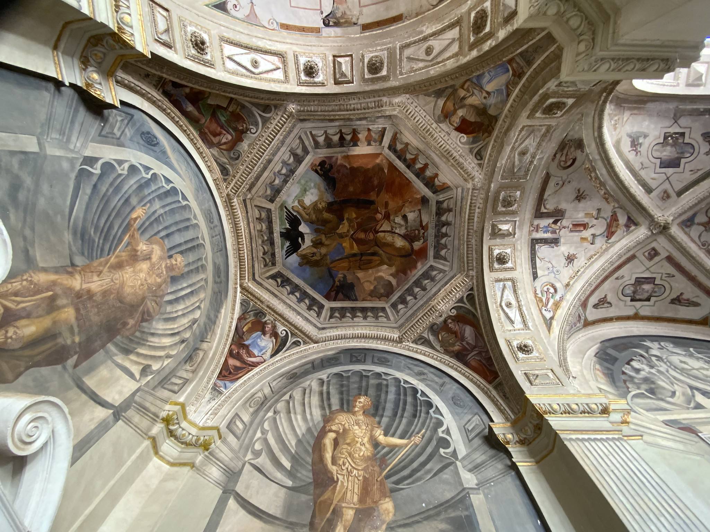{height=3in}

Se usa grisalla dorada para que destaquen sobre la grisalla del color habitual que simula una venera y que se continúa de forma más o menos sutil con las molduras de la esquina; este color simula bronce para proyectar una idea de nobleza. Usando el recurso de la *kalokagathia*, se muestra al enemigo turco con aspecto menos noble y casi racista. Del enemigo francés no se hace burla, pero sí aparece el rey francés, Francisco I, apuntando a la esquina donde se encuentra la alegoría de Turquía. Es decir, estas pinturas cumplen una función documental y educativa para los visitantes al palacio.

En la galería superior, el techo está ilustrado por diferentes alegorías entre grutescos, algunas de las cuales están bastante deterioradas. Encima de las alegorías de las naciones hay alegorías de los diferentes reinos que pertenecen a España

La narrativa del viaje del héroe comienza en el zaguán, con un programa iconográfico que tiene en el centro a Neptuno con atributos de "Quod ego", parando a los vientos. Como introducción al espacio narrativo, Neptuno puede tanto representar un ideal heroico como un "padre putativo", con cierta relación con Álvaro de Bazán "el viejo", también marino como él, y de hecho persona de la que parte la idea de la construcción de este palacio.

Siguiendo el eje del patio nos encontramos con el tramo de subida a la escalera, una especie de "educación humanista" que confronta los trabajos de Hércules con los vicios como la Gula o la Pereza; es una vez más la dualidad amigo/enemigo (en el patio inferior) esta vez entre el vicio y la virtud en su vertiente heroica. En el primer descansillo volvemos a encontrarnos a los trabajos de Hércules.

Las bóvedas a derecha e izquierda de la escalera romperían esta progresión narrativa y podrían situarse más en el área de la ilustración o documentación. Ambas se corresponden, y hablan de la fundación de Roma con diferentes escenas relacionadas con la misma. En realidad cuando se llega a este descansillo la vista se dirige hacia la derecha. El siguiente descansillo nos situaría en la encrucijada [@torrijos2007alegoria] con el fresco de la bóveda y la estatua de Bazán como Marte (vista anteriormente) formando un todo iconográfico unitario.

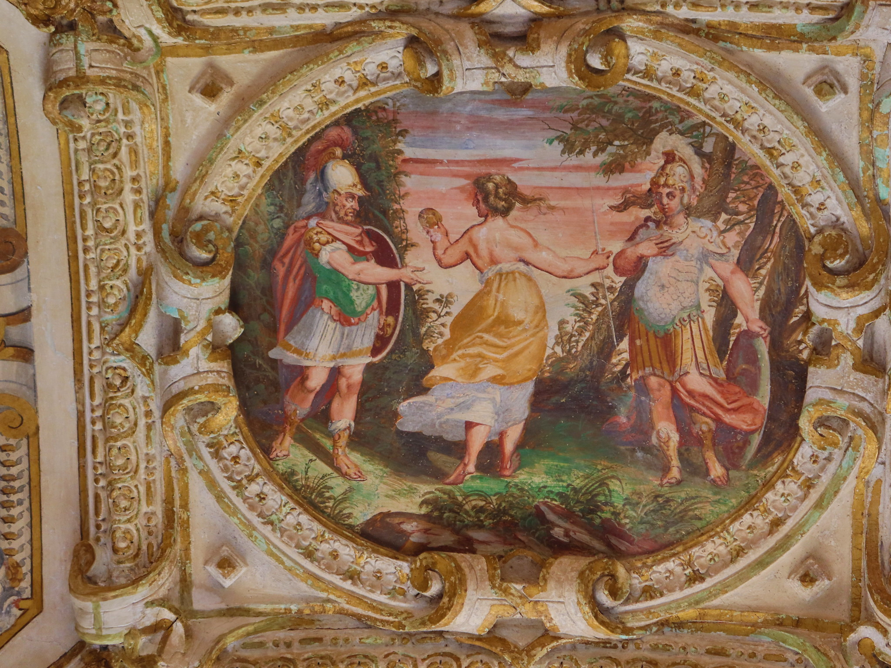{height=3in}

Esta bóveda representa a un soldado delante de dos diosas: una de espaldas, y vestida sola con una túnica ligera, y una segunda con lorica y armada con un escudo. El guerrero, a la izquierda de la imagen, señala a esta última, que se lleva la mano al pecho como admitiendo la elección. Tras las bóvedas de los trabajos de Hércules y los vicios, en este punto vital Bazán el soldado hace su elección: elige las armas y la virtud, sabiendo que es un camino duro, pero que eventualmente le llevará a la fama [@lopez2020lugar]. La bóveda por encima de la estatua de Bazán como Marte muestra la Victoria, recalcando que es la elección correcta. El tramo siguiente, de subida reafirma este mensaje, representando a la fama y la victoria a la que se llega a través de la Virtud.

El programa iconográfico al que se llega inmediatamente en la planta superior muestra a su familia en el dormitorio, a su estirpe y las batallas ganadas por los mismos, y una serie de habitaciones inspiradas en textos clásicos como las Metamorfosis de Ovidio, con héroes y heroinas tentados por los dioses y premiados o castigados por los mismos. La planta superior, así mismo, muestra batallas y planos de ciudades como Venecia.

Estas ciudades demuestran una vez más el conocimiento del mundo pero también al ser escenarios de batallas el camino que ha recorrido el héroe. Y nos lleva al tramo de descenso de las escaleras. En la bóveda del descansillo donde se encuentra Bazán como Neptuno nos encontramos con alegorías de la Fortuna.

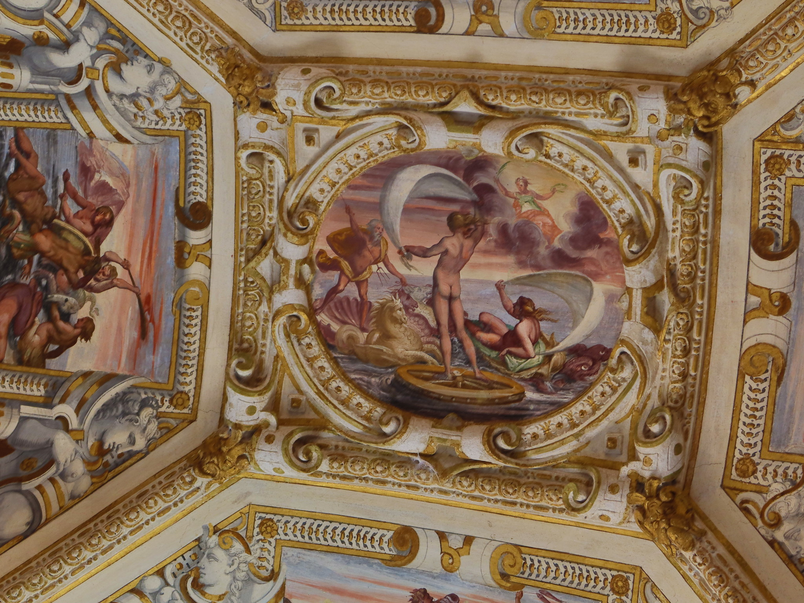{height=3in}

En la imagen la Fortuna, desde el cielo, se sirve de Neptuno, es decir, del propio Bazán, para ayudar y salvar del naufragio a las dos figuras. Bien es sabido que la Fortuna ayuda a los audaces y Bazán lo era; con el emparejamiento de la Fortuna y la Virtud/Fama se sigue el lema *virtute duce, comite fortuna*: la virtud como guía, la fortuna como compañera.

En resumen, se trata de un programa iconográfico complejo, con una fuerte intervención del comitente, que muestra claramente el *cursus honorum* y la formación de Álvaro de Bazán. En conjunto se trata de un patrimonio único por su concepción manierista al estilo genovés que tuvo una gran influencia en el inicio del Barroco en España.

### Contexto histórico-cultural

España no anda falta de etapas en su historia en las que un noble ha mirado la oferta existente y ha pensado "Uf, no hay nada que me guste. A ver qué se cuece en Italia". Sobre todo nobles que, como Álvaro de Bazán, habían visto en Italia como su amigo Andrea Doria encontraba arte y arquitectura a su medida.

En todo caso, el Renacimiento y especialmente la última mitad del siglo XVI nos muestra una España con un nivel de arquitectura notable en conocimiento técnico y de las modas importadas de Italia, pero bastante inferior en escultura y pintura, especialmente pintura al fresco. 

Felipe II se convirtió en rey en 1556 y decidió erigirse en máximo defensor de la fe católica. En ese contexto se entienden las múltiples batallas en las que participó Álvaro de Bazán, de las cuales la principal fue la batalla de Lepanto que enfrentó a la Liga Santa convocada por el Papa. Una victoria táctica muy clara cuyas consecuencias estratégicas fueron bastante escasas, al menos para España. 

Por si fuera poco luchar contra el infiel, Felipe II se encontraba también luchando con una serie de correligionarios: tuvo que luchar también para imponerse como sucesor de Sebastián I de Portugal en contra del prior de Crato y en contra de las tropas francesas que acudieron en su ayuda. En varias de estas acciones fue una vez más decisivo Álvaro de Bazán, que también ayudó a derrotar diferentes incursiones de corsarios ingleses en las costas españolas.

En este contexto de guerra interminable, las finanzas del rey no podían ejercer ningún tipo de mecenazgo sobre las artes y los artistas, aparte de la declarada preferencia de Felipe II por artistas italianos como Ticiano o Sofonisba Anguissola. Estos influyeron en la pintura de esa época, con artistas como Sánchez Coello adoptando los manierismos de Anguissola y otros como "El Mudo" aprendiendo, a través de los cuadros copiados, de Ticiano y otros autores italianos.

En la imaginería predomina la imagen religiosa; la imagen de la nobleza está dominada por la funeraria. Por eso irrumpe con tanta fuerza [@checa:pinturayescultura] el programa iconográfico del Viso del Marqués, dando una imagen completa con raíces humanistas del noble, pero demás aportando un programa decorativo basado en los grutescos y la arquitectura simulada que evolucionaría hacia la decoración de El Escorial.

En general, y como se afirma en "Invariantes castizos", el arte en España es de "aluvión". Este aluvión, al menos, creó un delta sumamente fértil donde florecería la pintura, la escultura y la arquitectura en las décadas sucesivas.

## San Antonio de los Alemanes

Como en el caso del siglo XV, escogemos un solo edificio; tratándose de una obra barroca, cabe esperar la integración de todas las artes; sin embargo, gran parte de la obra escultórica, sobre todo decorativa, que se ve hoy en día es posterior, por lo que nos fijaremos inicialmente en una escultura a que, aunque no está integrada artísticamente con el edificio, sí encaja perfectamente con el origen y el significado iconográfico del mismo.

### San Antonio de Padua en el altar, de Manuel Pereira

Hay dos esculturas con el mismo tema y autor. Escogeremos la que está situada en el altar

#### Autor

Manuel Pereira

#### Cronología

1631-1633

#### Tipología

Imagen de madera de pino policromada y ahuecada [@guzman08]

#### Análisis descriptivo

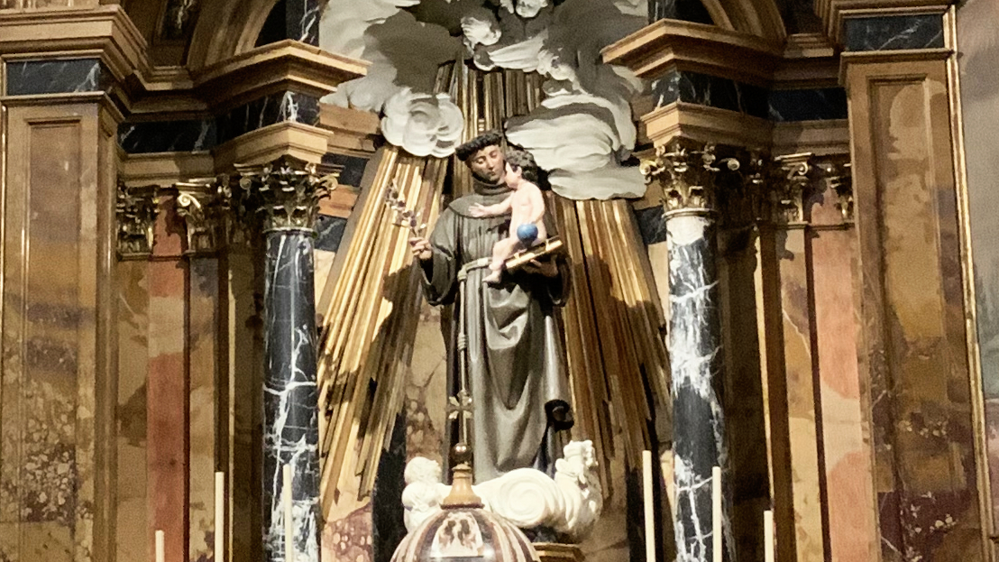

San Antonio de Padua, con tez oscura que denota su procedencia de Portugal y hábito franciscano, tiene la cabeza ligeramente ladeada mirando, con ojos caídos, a un Niño. El Niño alarga la mano tratando de alcanzar una rama de lirios de plata que San Antonio agarra con su mano izquierda. Con la mano derecha, San Antonio sostiene un libro cerrado sobre el que, a su vez, se encuentra el Niño. El niño tiene en su mano izquierda un orbe. A los rostros, sea por el origen portugués del autor o por un examen pormenorizado y comparativo, se les atribuye una cierta melancolía o *saudade*, que en todo caso permitió discernir a Pereira como autor de las mismas por comparación con otras tallas suyas conocidas en Portugal.

Todo ello corresponde a la iconografía tradicional de San Antonio de Padua, un santo franciscano nacido en Lisboa y muerto en Padua, de ahí su nombre. Pero la consagración a este santo se debe a que inicialmente la iglesia se creó para la comunidad portuguesa; esto posiblemente también explica el encargo a Manuel Pereira, de origen portugués, de esta talla. Así que no se trata de nuevo de una importación de artistas por falta de artífices adecuados en el suelo patrio, sino de algo totalmente justificado por el contexto. Además, una vez hechos una serie de encargos en Madrid acabó formando parte de la llamada Escuela Madrileña, junto con Bussi o Rioja [@urrea1977manuel]. De hecho, Palomino [@palomino] dice de él 

> Y en fin tuvo obras de tanta entidad que llego á estar muy acomodado, favorecido de la fortuna, y estimado de todos

La imagen encaja dentro del espíritu del *decoro* de la contrarreforma y el fin educativo, aristotélico, de las mismas [@maravall1975cultura]. Muestra el diálogo entre un Santo y Dios implicando su carácter de mediadores. San Antonio de Padua, además, "martillo de herejes", es un santo especialmente adecuado para la Contrarreforma; su designación como maestro de la Iglesia y la presencia del libro en la imagen muestra la importancia que ésta le daba al magisterio frente a la reforma luterana. Es posible que además se encuentre implícitamente en el uso del santo y en la talla el hecho de que el milagro que representa (el Niño bajando a posarse sobre el libro cuando San Antonio explicaba el misterio de la Encarnación) sea también un dardo dirigido a los moriscos que habían sido recientemente expulsados pocas décadas antes. En cualquier caso, un santo y una talla que encarnan muy bien el espíritu de la Contrarreforma y su versión española, aún más intolerante.

Esta tipología, que remite a Juan de Juni (en el Museo Nacional de Escultura de Valladolid), aunque en este último caso tanto el Niño como el santo agarran el orbe, no sería muy replicada como escultura, con modelos posteriores, especialmente del barroco granadino, eliminando el libro e incluso el orbe para centrarse en las figuras del santo y del Niño; el hábito franciscano también suele usar un tipo de rugosidad en Alonso Cano y posteriores que aquí todavía no aparece. Sin embargo, hay cuadros que repiten estos atributos en el barroco español (Murillo, San Antonio de Padua con Niño) e internacional (Guercino, San Antonio de Padua con el Niño Jesús, 1656). De hecho, la estatua de San Antonio de Padua de Juni parece más barroca, con estofado, pliegues arremolinados y unas carnaciones algo exageradas. Pereira combina unos pliegues verticales por encima del cíngulo con otros más angulares, con la túnica recogida, por debajo, pero con un color de túnica uniforme y unas carnaciones más "decorosas" e idealizadas. Pereira se esmera más en el tratamiento del pelo, formando rizos y remolinos en las dos figuras. Se trata de un tratamiento sereno, propio del barroco clasicista [@urrea1977manuel] más que manierista o barroco pleno. Es difícil, sin embargo, afirmar algo sobre la policromía ya que la que existe actualmente es del siglo XVIII [@guzman08]. Sería factible que la original fuera más parecida a la de Juan de Juni, y que el aspecto "clásico" de la misma proceda más de una reinterpretación casi neoclásica de la figura original, posiblemente deteriorada. En todo caso, el clasicismo de la policromía encaja bien con el de la composición y los rasgos de las figuras.

El retablo en el que se encuentra ahora mismo es muy posterior, del siglo XVIII y desmerece un tanto el barroquismo contenido de esta imagen.

### Fábrica de la iglesia de San Antonio de los Portugueses

#### Autor
#### Cronología
#### Tipología:
#### Análisis descriptivo
#### Contexto histórico-cultural

### Pintura de la cúpula

La pintura se llevó a cabo en dos etapas, la primera en 1662-66 en la que se realiza la cúpula y algunos adornos y la segunda a partir de 1698 por parte principalmente de Luca Giordano. Nos centraremos en la primera, ya que este edificio ha sido elegido como muestra del arte del siglo XVII. También evitamos los cuadros que decoran las capillas, porque aunque son los único de la misma época que la construcción de la iglesia, constituyen un programa iconográfico ligeramente diferente.

#### Autor

Juan Carreño de Miranda (principales motivos de la cúpula) y Francisco Rizi (sobre todo trampantojos) [@arranz_1999]. Como se ha indicado en la introducción, las aportaciones de Luca Giordano son posteriores y no serán objeto de este análisis.

#### Cronología

Entre 1662 y 1666; por lo tanto, muy posterior a la construcción del tempo, pero todavía dentro del siglo XVII.

#### Tipología

Se trata de pintura al fresco.

#### Análisis descriptivo

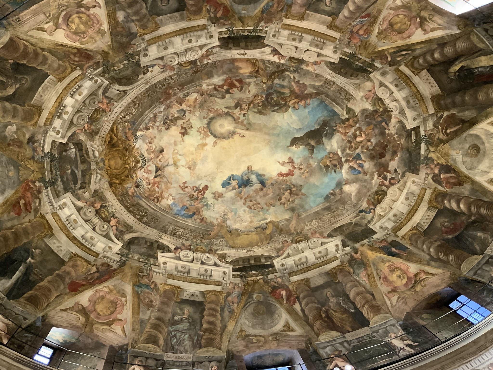

La cúpula ovalada se asienta sobre un tambor de la misma forma; las ventanas reales del tambor se continúan don frontones triangulares partidos con cupulillas circulares simuladas; están separadas por nichos sobre putti que ejercen como atlantes soportando una cornisa con columnas salomónicas simuladas y terminado en un frontón partido con volutas. Estos frontones son molduras reales, que dan paso a una serie de arcos con un tambor adicional simulado y un friso decorado con escudos. Las columnas salomónicas fueron añadidas sobre las lisas originales por Luca Giordano [@castano2021detras].
Este friso está partido a la derecha de la imagen, perpendicular al escudo y marcando la axialidad del óvalo en su eje mayor, por un grumo de nubes y putti sobre el cual se encuentra San Antonio de Padua; San Antonio se situaría por tanto encima del altar, con el escudo de Portugal encima de la entrada a la iglesia.

Antonio de Padua, con un libro abierto sostenido por putti a sus pies, mira con los brazos abiertos a un Niño a su derecha y sobre una nube sostenida por, lo sospechaste, más putti. A los pies del santo se adivina un ramo de lirios pintado con una exrema delicadeza. Este extiende su brazo hacia arriba dirigiendo nuestras miradas hacia un círculo sostenido por, como no, putti de cuyo centro oscurecido emana una luz que ilumina al santo. La Virgen con un manto azul se sitúa detrás del Niño. San Antonio, el Niño y la Virgen forman una línea, indicando como se ha dicho en la escultura la mediación con Dios; esta línea forma un ángulo agudo con el haz de luz que ilumina a San Antonio. 

Los diferentes planos se crean mediante *sfumati* o gradaciones de color, que van del azul al plano celestial al dorado del centro del óvalo, donde parece que se insinúa un espíritu santo irradiante. Toda la composición es de una teatralidad considerable, con las expresiones y los gestos de las manos dirigiendo la mirada del espectador hacia uno u otro lado, creando una narración que exalta la figura de San Antonio como interlocutor celestial. Los efectos de las sombras y pliegues de las ropas de San Antonio, en *chiaroscuro*, acentúan el dramatismo. El manto rojo del Niño y azul de la Virgen parecen ingrávidos, sosteniendo a quien los lleva y con sus pliegues creando efectos de luces y sombras impresionantes.

Aunque la ejecución de esta cúpula es de Rizi, se conservan [en el Museo del Prado dibujos preparatorios](https://www.museodelprado.es/coleccion/obra-de-arte/apunte-para-la-vision-de-san-antonio-de-padua-la/82b84a87-093d-43ae-bed8-eff5d273888a) que están basados en otros bocetos anteriores de Angelo Michele Colonna  [@arranz_1999]. En algunos artículos se atribuye a este, junto con Agostino Mitelli, la concepción general de la cúpula, cuya ejecución está acreditada por Rizi, entroncando así estos primeros pasos del barroco decorativo madrileño con el boloñés de Rizi. 

Sin embargo, el momento que refleja, el de la llamada visión de San Antonio de Padua, ha sido representado a menudo en el barroco hispano. Sentado en su estudio en el sur de Francia, el santo es visitado por el Niño Jesús, que le muestra el cielo; la luz celestial que emana de la habitación es contemplada por el casero, que consigue tener también un atisbo de esa visión celestial. [La "Visión de San Antonio de Padua"](https://www.archisevillasiempreadelante.org/vision-san-antonio-padua-murillo/), de Murillo, usa una composición del Niño y San Antonio similar; [el cuadro de Carducho](https://www.epdlp.com/cuadro.php?id=3596), maestro de Rizi, muestra una composición lineal entre Virgen, Niño y San Antonio que evoca la de esta iglesia. La alusión al barroco boloñés plasmada en la historiografía clásica es tentadora, pero en este caso me inclinaría más por una genealogía totalmente local.

Y no solo eso, una pieza que traería descendencia, como veremos más adelante en el Sagrario de La Cartuja.

#### Contexto histórico-cultural

## Sagrario de la Cartuja de Granada

El Sagrario de la Cartuja se construyó a principios del siglo XVIII; con sus esculturas y frescos será lo elegido para este siglo.

### Fábrica y arquitectura del Sagrario

#### Autor
#### Cronología
#### Tipología

#### Análisis descriptivo

El Sagrario o *Sancta Sanctórum* está concebido en la arquitectura cartujana como un espacio "oculto" detrás del altar y destinado principalmente a la adoración privada de los cartujos por separado de los frailes legos [@lozano2023orden], configurándolo de forma que "proteja del mundo exterior" [@ramos2021arquitectura]. El arquitecto Francisco Hurtado diseñó este espacio como un todo unitario que integra la arquitectura, la escultura y la pintura, tanto al fresco como de caballete, como una *máquina de rezar* y de exaltación de la Comunión y de la orden cartujana; sin embargo, este arquitecto falleció sin llegar a ver su ejecución completada.

Como tal espacio privado, la composición arquitectónica del mismo dirige la mirada hacia la cúpula, y esta cúpula es una espiral de escenas en cuyo centro está el Espíritu Santo, en un círculo dorado que parece romper la estructura de la cúpula, abriéndose al cielo. Los dos óculos reales, al norte (norte-nordeste, en realidad) y al sur (sur-suroeste), dan luz al espacio a cualquier hora del día [@almagro2010planimetria]. Se buscaba que los monjes fueran capaces de entender el significado simbólico de esta decoración, que se divide en dos vertientes: la eucarística y la monástica. La primera es la principal clave de la cúpula, aunque también representa a San Bruno llevando en sus hombros al mundo, pero este es un simple pedestal para la custodia eucarística; San Bruno está alineado con la misma y con el Espíritu Santo y con el centro de la Trinidad, que ocupa el centro de la cúpula.

### Frescos de la cúpula del Sagrario

#### Autor
#### Cronología
#### Tipología:
#### Análisis descriptivo

El planteamiento iconográfico de la cúpula lo describe el propio Palomino hablando de la cúpula del monasterio de El Paular, del mismo autor y realizado a continuación, capítulo XIV del Libro Nono del Tomo Segundo de [@palomino]; aunque hay diferencias, los elementos principales son comunes: 

> En el lugar mas supremo se mirará la Trinidad santísima en un gran trono de nubes, asistida de angeles, y serafines [...] María santísima, coronada reyna de los angeles [...] al otro lado San Juan Bautista, y san Joseph

La profusión de figuras, aunque más contenida y mejor perfilada que la de los Desamparados en Valencia, tiene forma de *apoteosis barroca* [@roman2020pinturas] y ciertas similitudes con la cúpula de la escalera del Escorial creada por Lucas Giordano; en esta apoteosis, la perspectiva se ha realizado con precisión, siguiendo los preceptos matemáticos que el propio Palomino estudió y desarrolló en sus escritos.

### Esculturas en el Sagrario

#### Autor

#### Cronología
#### Tipología:

#### Análisis descriptivo

### Contexto histórico-cultural

Acisclo Antonio Palomino de Castro y Velasco (1655-1726) [@palomino] fue un pintor y tratadista nacido en Córdoba que desarrolló su labor principalmente dentro del barroco andaluz y español. A partir de su contacto con Luca Giordano, llegado a Madrid para un encargo real, se interesaría y desarrollaría su labor en diferentes edificios religiosos como la basílica de los Santos Juanes o de los Desamparados en Valencia aparte de la que nos ocupa, la Cartuja de Granada, de las últimas obras en las que trabajaría antes de su muerte; siendo la última el Sagrario de la Cartuja de El Paular. Siendo la Cartuja una obra de madurez, en ella reflejaría toda su maestría en la composición, la luz, y dominio de la preparación y la técnica pictórica.

En un contexto más amplio, la exaltación de la Eucaristía como sacramento católico forma parte del movimiento de rearme espiritual propiciado por la Contrarreforma del concilio de Trento. Al rechazar la transubstanciación, el protestantismo convirtió a la comunión en un punto de debate. En pinturas tales como esta se trata de mostrar ese concepto abstracto, la presencia en cuerpo y sangre de cristo en la comunión, de forma simbólica y comprensible para todos, aparte de resaltar el triunfo de la Comunión sobre los pecados del mundo, simbolizados por la custodia culminando la bola del mundo.

Esta devoción eucarística, centrada en el Sagrario como tipología arquitectónica típica de las cartujas españolas, tienen su culmen en este, y su foco en la cúpula, verdadero centro iconográfico y también religioso de la misma [@deCeballos], con el contexto añadido del recogimiento y silencio característico de la orden cartuja.

## Créditos de las imágenes

Todas las imágenes son del autor, con licencia cc-by-sa, salvo los casos que se comentan a continuación.

## Referencias
